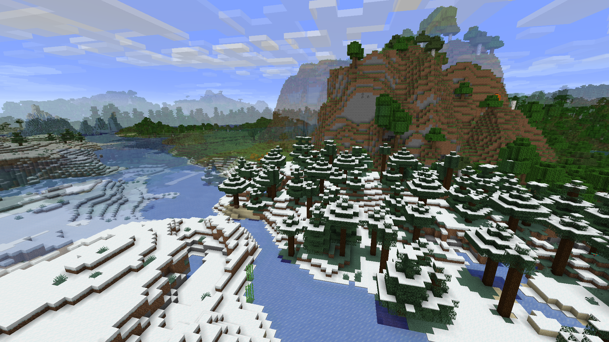

# Homerun


Homerun is a Minecraft server plugin that lets you reset the world under specific conditions. Though Homerun can reset
your entire server world, it can be set to keep specific chunks or regions intact. With Minecraft 1.18's chunk blending
functionality, Homerun can reset your world while keeping the borders with kept chunks smooth and natural.

Homerun works for 1.21.4 and above. Updates for the plugin are provided for servers running Minecraft 1.21.11. More
information on supported versions can be found in the [Development](#development)
section. [MCKotlin](https://modrinth.com/plugin/mckotlin) ([GitHub](https://github.com/4drian3d/MCKotlin)) is required
for Homerun to work.

> [!WARNING]
> Homerun **directly modifies** your world files during resets. It is **highly recommended** to back up your worlds
> in some other way before using Homerun. Homerun **will persist old worlds** and avoid deleting worlds, but it is still
> a good idea to have backups in case something goes wrong.

## Features



* Reset world based on time intervals
* Keep specific chunks intact during resets
* Smooth chunk blending for kept chunks (Minecraft 1.18+)
* Reset the Nether and The End (and keep chunks there too)
* Warnings and countdowns for upcoming resets

### Configuration

Homerun is configured through a `config.yml` file (see the defaults [here](./src/main/resources/config.yml)). It
currently accepts one top-level key: `reset_rules`, which is a list of reset rules. Each reset rule has certain
conditions and one or more parameters, and can have a name, be disabled, or have warnings.

#### Reset rules

| Key            | Default | Type                             | Description                                                                                                                         |
|----------------|---------|----------------------------------|-------------------------------------------------------------------------------------------------------------------------------------|
| `name`         | *none*  | `string` (optional)              | An optional name for the reset rule.                                                                                                |
| `disabled`     | `false` | `boolean` (optional)             | If true, this rule will be disabled. This can be used to easily disable rules.                                                      |
| `notify_enter` | `false` | `boolean` (optional)             | If true, players will be notified when they enter a reset-protected area.                                                           |
| `notify_exit`  | `false` | `boolean` (optional)             | If true, players will be notified when they leave a reset-protected area.                                                           |
| `borders`      | *none*  | list of BorderTypes (optional)   | A list of borders that can appear to the player when they get near a reset-protected area. See [Border types](#border-types) below. | 
| `conditions`   | *none*  | list of ResetCondition           | A set of conditions to be used for resetting the server. See [Reset conditions](#reset-conditions) below.                           |
| `parameters`   | *none*  | list of ResetParameters          | A list of parameter sets for the reset. See [Reset parameters](#reset-parameters) below.                                            |
| `warnings`     | *none*  | list of ResetWarnings (optional) | A list of warnings to be issued before the reset occurs. See [Warnings](#warnings) below.                                           |

#### Reset conditions

Reset conditions are listed with the settings they need. The following reset conditions are available:

* `cron` – Reset the world on a cron schedule (see [crontab.guru](https://crontab.guru/) for help with cron syntax). The
  cron is based on the server's local time and timezone.
  ```yaml
  conditions:
    - cron: "0 0 * * *" # Reset every day at midnight
  ```
  ```yaml
  conditions:
    - cron: "0 0 1 * *" # Reset on the first of the month at midnight
  ```
  ```yaml
  conditions:
    - cron: "0 0 1 */2 *" # Reset on every second month (first of odd numbered months)
  ```
* `always` – Always reset the world when this rule is checked.
  > **WARNING:** Using this condition when your world requires a restart (i.e. `restart: true` in parameters) may cause
  > an infinite restart loop.
  ```yaml
  conditions:
    - always: true
  ```

#### Reset parameters

Reset parameters define how the reset should be performed. The following reset parameters are available:

| Key                        | Default  | Type                              | Description                                                                                                                                                                                                                                                                                                                                                                                                                               |
|----------------------------|----------|-----------------------------------|-------------------------------------------------------------------------------------------------------------------------------------------------------------------------------------------------------------------------------------------------------------------------------------------------------------------------------------------------------------------------------------------------------------------------------------------|
| `retained_chunks`          | *none*   | list of ChunkSelectors            | A list of chunk selectors defining which chunks to keep during the reset. See [Chunk selectors](#chunk-selectors) below.                                                                                                                                                                                                                                                                                                                  |
| `world`                    | *none*   | `string` (optional)               | The world to reset. If not specified, the main world (`level-name` in `server.properties`) will be reset.                                                                                                                                                                                                                                                                                                                                 |
| `target_world_pattern`     | *none*   | `string` (optional)               | A pattern for the target world name when creating a new world during reset. Available patterns include: `world` (current world name), `timestamp` (current UNIX timestamp), `source_seed` (seed of old world), `reset_count` (how many resets has this world been through)                                                                                                                                                                |
| `modify_server_properties` | `false`  | `boolean` (optional)              | If true, Homerun will modify the `server.properties` file to update the `level-name` to the new world name after a reset. If you are using this, `server.properties` must be writable by the server. Enabling `restart` is highly advised if you set this to `true`.                                                                                                                                                                      |
| `restart`                  | `false`  | `boolean` (optional)              | If true, the server will automatically restart after the reset. This requires that your server is set up to restart automatically when it stops. Most hosts allow this, though if you are locally hosting, you need to provide a [restart script](https://gist.github.com/Prof-Bloodstone/6367eb4016eaf9d1646a88772cdbbac5) in `spigot.yml`.                                                                                              |
| `outside_player_behavior`  | `spawn`  | OutsidePlayerBehavior (optional)  | Defines what to do with players outside of retained chunks after a reset. Available behaviors include: `spawn` (teleport player to their spawn point), `kill` (kills the player), `world_spawn` (teleport player to the world spawn), `ignore` (do nothing, player may suffocate), `highest` (teleport player to highest block at their X/Z pre-reset), and `closest` (teleport the player to the closest block at their X/Y/Z pre-reset) |
| `nether_behavior`          | `normal` | DimensionResetBehavior (optional) | Defines how to handle the Nether dimension during a reset. Available behaviors include: `normal` (reset the Nether like any other world), `wipe` (recreates the Nether based on the new world's seed), `copy` (copies the Nether from the previous world without resetting it), and `rename` (renames the previous Nether to match the new world's name)                                                                                  |
| `end_behavior`             | `normal` | DimensionResetBehavior (optional) | Defines how to handle The End dimension during a reset. Available options match the options for the Nether.                                                                                                                                                                                                                                                                                                                               |
| `end_pillar_cleanup`       | `normal` | `boolean` (optional)              | Whether end pillars should be cleaned up during resets and dragon respawns. The radius and height of End Spikes are based on the seed, which can change during a reset. Disabling this will prevent spikes from being fully wiped during respawns and stray end crystals from being deleted after resets.                                                                                                                                 |

##### Chunk selectors

Chunk selectors define which chunks should be kept during a reset. The following chunk selectors are available:

* `from_world_spawn` – Keep chunks within a certain radius from the world spawn.
  ```yaml
  retained_chunks:
    - from_world_spawn: 100 # Keep a square area of 100x100 chunks centered on the world spawn
  ```
  ```yaml
  retained_chunks:
    # Keep a rectangular area of 10x20 chunks centered on the world spawn
    - from_world_spawn:
        x: 10
        z: 20
  ```
  ```yaml
  retained_chunks:
    # Keep a rectangular area of radius 50 chunks centered on the world spawn
    - from_world_spawn:
        north: 50
        south: 50
        east: 50
        west: 50
  ```
* `specific_chunks` – Keep specific chunks by their coordinates. Note that this uses chunk coordinates, not block
  coordinates.
  ```yaml
  retained_chunks:
    - specific_chunks:
        - [ 0, 0 ] # Keep chunk (0, 0)
        - x: 1
          z: -1 # Keep chunk (1, -1)
  ```

#### Border types

Border types appear as visual indicators in the world that tell a player where the reset-unprotected areas are. These
usually show up on the first block that is reset-unprotected (i.e. it shows up on the edges of chunks that will be
reset.)
The following border types are available:

* `type: highest_block` – Displays a border block on top of the highest block at the border chunk. Note that this
  currently does not work well underground. The block is client-side only, so it will not actually be placed or cause
  any block updates.
  ```yaml
  borders:
    - type: highest_block
      block: redstone_block # The block to use for the border.
      distance_chunks: 3 # How many chunks away does the player have to be for the blocks to show up? Default is 3.
      # The heightmap to use for determining the highest block. Default is MOTION_BLOCKING.
      # You can use something else like ocean_floor if you want the border blocks to show up underwater instead of over.
      # You can find all possible heightmaps in the Minecraft Wiki: https://minecraft.wiki/w/Heightmap
      heightmap: MOTION_BLOCKING
  ```
* `type: particles` – Displays a line of particles at the border chunk. The particles are client-side only.
  ```yaml
  borders:
    - type: particles
      particle: dust # The particle to use for the border. In this case, red dust.
      # Additional particle data.
      # - For dust, this includes the `color` (can be a named color, chat color code, or RGB value in hexadecimal
      #   format: #RRGGBB) and `size` (a float value for the size of the particle).
      # - For particles that copy blocks (e.g. "block" or "falling_dust"), this is the name of the block to copy, or a 
      #   `block` (the name) and `data` (the block data, as a string, e.g. for a `redstone_lamp`, you can use
      #   `data: '[lit="true"]'`; note that the quotes are necessary).
      # - For particles that copy items (e.g. "item"), this is the name of the item to copy, or an `item` (the name) and
      #   `data` (the item data, as a map).
      # - This should be left blank if the particle does not require additional data, e.g. "flame" or "heart".
      data:
        color: red
        size: 1.5
      distance_blocks: 3 # How many blocks away does the particles have to be for the particles to show up? Default is 3.
      # The height controls how tall the particle line is. It starts at the height of the player, and grows both up and
      # down, with more priority going up. When the height is less than 3, the particles will always spawn on the topmost
      # passable block next to the player. This makes it visible even when in caves or swimming.
      height: 2
      # A pattern to use for the particles. This controls how the particles are spawned at the border.
      # - `random` (default) spawns particles randomly within the block at the border.
      # - `dot` spawns particles at the center of the block at the border, creating a dotted line effect.
      # - `vertical` spawns particles in a vertical line at the border, creating the illusion of jail bars.
      pattern: random
  ```

#### Reset warnings

Warnings provide a way to notify players of an upcoming reset. The following warning types are available:

* `type: boss_bar` – Displays a boss bar to all players with a custom message and countdown.
  ```yaml
  warnings:
    - type: boss_bar
      message: "World reset in {time}!"
      countdown: 60 # Show the boss bar for 60 seconds before the reset
  ```
* `type: player_list` – Displays a message in the player list header and footer with a custom message and countdown.
  ```yaml
  warnings:
  - type: player_list
    position: header # Can be 'header' or 'footer'
  ```
* `type: chat_message` – Sends a chat message to all players at specified intervals (in seconds before reset).
  ```yaml
  warnings:
    - type: chat
      # 1 day, 12 hours, 6 hours, 1 hour, 10 minutes, 5 minutes, 1 minute, 30 seconds, 10 seconds, 5 seconds, 4 seconds, 3 seconds, 2 seconds, 1 second
      intervals: [ 86400, 43200, 21600, 3600, 600, 300, 60, 30, 10, 5, 4, 3, 2, 1 ]
  ```

### Commands

Though Homerun mostly works through configuration files, it also provides some commands for server operators:

* `/homerun reset <rule>` – Immediately reset the world using the specified rule
* `/homerun tpworld <world>` – Teleport to the specified world, keeping position and rotation of the player
* `/homerun reload` – Reload the configuration. This immediately re-processes all reset rules.
* `/homerun reloadcachedchunks` – Reload the chunk cache, which powers reset borders and entry/exit notifications
* `/homerun lockout <enable/disable> <world>` – Enable or disable lockouts for a world. Lockouts prevent a player from
  joining or teleporting into a world that is currently being reset.

### Development

> [!WARNING]
> Due to how Homerun works, it **integrates strongly with Minecraft internals** and directly accesses Minecraft's code,
> [against the suggestion](https://docs.papermc.io/paper/dev/internals/) of PaperMC maintainers.

Because programming against Minecraft internals very frequently causes incompatibilities with Homerun's source code, we
remain committed to supporting only **Minecraft versions released in the last 12 months** available for general use with
Paper. Sometimes, when there are no significant changes to the rest of Minecraft's internal code, a Homerun version may
support multiple Minecraft versions.

Homerun uses semantic versioning. The format, as usual, is `<MAJOR>.<MINOR>.<PATCH>`. Homerun will always increment
major versions whenever the list of supported Minecraft versions changes. Always pick the appropriate major version for
your Minecraft server version.

You can help us out at https://github.com/team-luminova/Homerun. Pull requests are appreciated, and we'll try to give
reviews within a reasonable amount of time. To being developing for Homerun, just clone the repository and open it with
your IDE. Gradle should take care of the rest.

You can find more information on the development of Homerun in the [DEVELOPMENT.md](./DEVELOPMENT.md) file.

## License

```
Copyright 2025 Chlod Alejandro and contributors

Licensed under the Apache License, Version 2.0 (the "License");
you may not use this file except in compliance with the License.
You may obtain a copy of the License at

       http://www.apache.org/licenses/LICENSE-2.0

Unless required by applicable law or agreed to in writing, software
distributed under the License is distributed on an "AS IS" BASIS,
WITHOUT WARRANTIES OR CONDITIONS OF ANY KIND, either express or implied.
See the License for the specific language governing permissions and
limitations under the License.
```